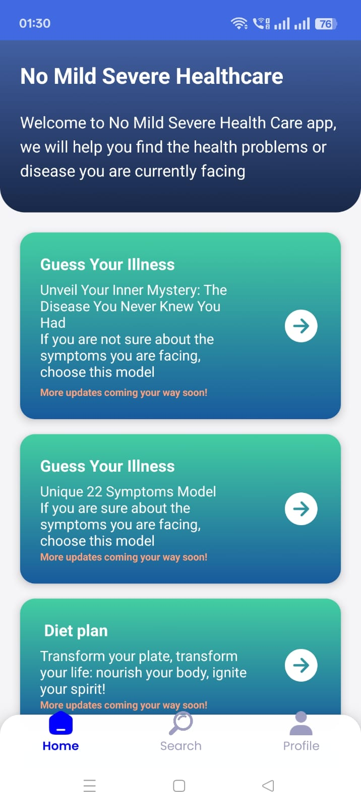
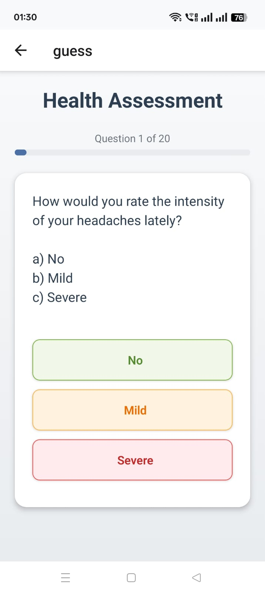
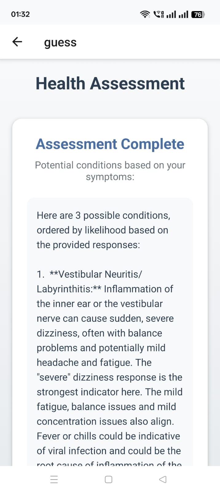

# 🩺 TeamZenith HealthCare App

The **TeamZenith HealthCare App** is a cross-platform mobile health assistant that guides users through symptom-based questionnaires, predicts potential diseases using AI, and generates medical reports. It’s built with **React Native (Expo)** and powered by a **Flask backend**.

---

## 🧠 Key Features

- ✅ Symptom-based interactive diagnosis  
- 📄 Auto-generated downloadable health reports (DOCX)  
- 🔒 Firebase Firestore for storing user data securely  
- 📱 Clean and responsive user interface  
- ⚙️ Smart backend logic for dynamic question generation  

---

## 📲 Screenshots

| Home Screen | Questionnaire | Prediction Result | PDF or Docx Report |
|-------------|----------------|--------------------|--------------------|
|  |  |  |.png) |

> 📷 

---

## 👤 User Instructions

Here’s how a user interacts with the app:

1. **Open the App**  
   Launch the app using Expo Go or an emulator.

2. **Provide Initial Information**  
   Enter basic health metrics (height, weight, etc.) and initial symptoms.

3. **Answer Follow-Up Questions**  
   The app will ask dynamic follow-up questions based on the symptoms you selected.

4. **Receive Prediction**  
   After answering all questions, the app will send your responses to a Flask backend to predict a possible disease.

5. **Download Report**  
   You’ll get a downloadable `.docx` file containing the prediction summary and recommendations.

---

## 🔧 Tech Stack

- **Frontend:** React Native (Expo), TypeScript  
- **Backend:** Flask (Python)  
- **Database:** Firebase Firestore  
- **AI/ML Model:** Custom-trained disease predictor  
- **Report Gen:** Python-docx & PDF 

---

## 📁 Project Structure

